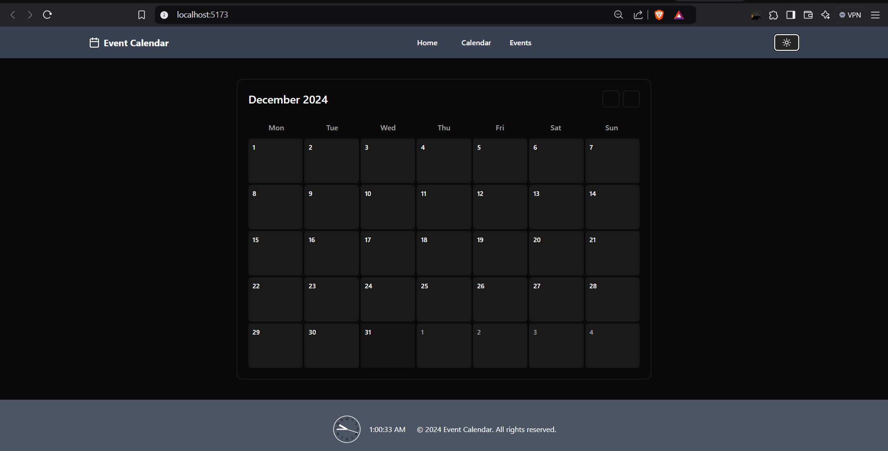
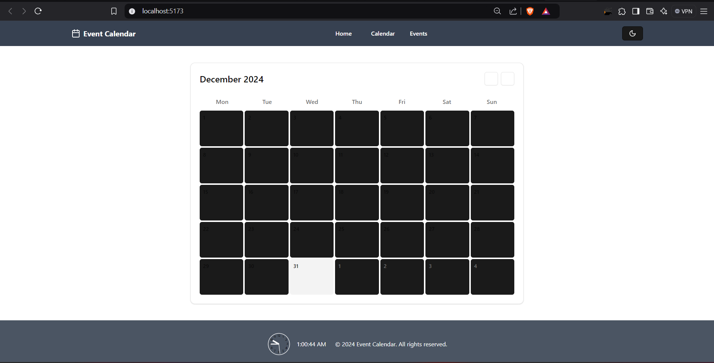
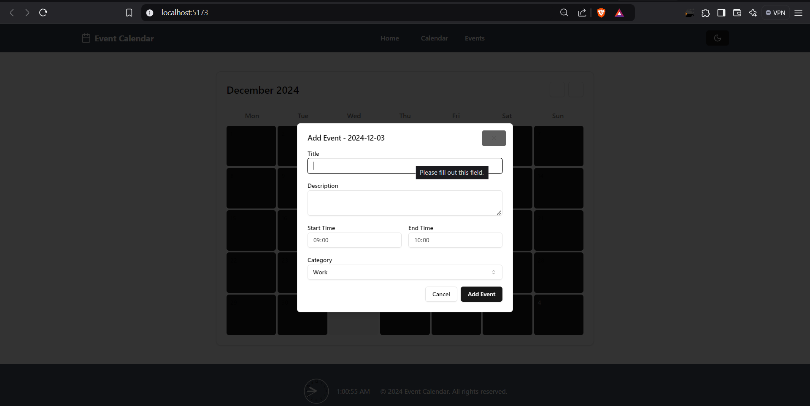
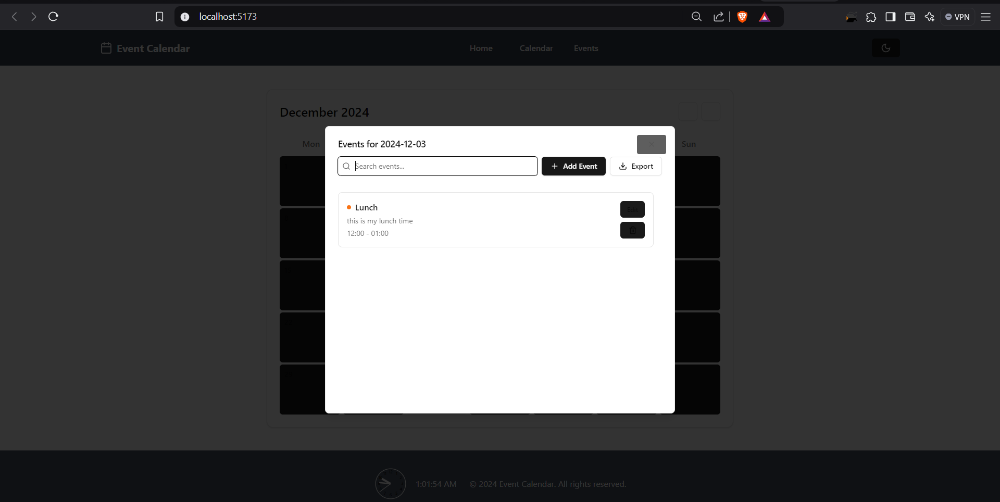

# Event Calendar

## Overview
The **Event Calendar** is a web application that integrates a real-time clock, displaying the current time on an interactive analog-style dial. It features a footer that updates the time every second, along with a simple calendar layout and event tracking functionality.






## Features
- **Interactive Clock**: Analog-style clock with real-time updates showing hours, minutes, and seconds.
- **Dynamic Time Display**: The current time is displayed both on the clock and as a digital readout in the footer.
- **Responsive Design**: The UI adapts across devices using Tailwind CSS for styling and responsiveness.
- **Footer with Event Calendar**: A footer showing the current year and basic event tracking functionality.

## Tech Stack
- **React**: JavaScript library for building the user interface.
- **Tailwind CSS**: Utility-first CSS framework for styling and layout.
- **SVG**: Used for creating the clock dial and hands for the analog clock.
- **JavaScript (ES6+)**: For real-time clock functionality and updates.

## Installation

- 1. Clone the repository:
   ```bash
     git clone https://github.com/your-username/event-calendar.git 
    ```
- 2. Install dependencies using npm:
     ```
       cd event-calendar
       npm install
     ```
- 3. Start the development server:
     ```
     npm run dev
     ```

- 4. Building for Production:
     ```
     npm run Build
     ```
- 5. Configure Vite Server:
  ```
   // vite.config.js
   export default {
  server: {
    port: 5137, // Change the port to 5137
    },
   };
  ```
## Open the application in your browser at:
  - http://localhost:5137
